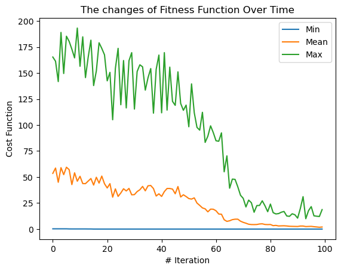
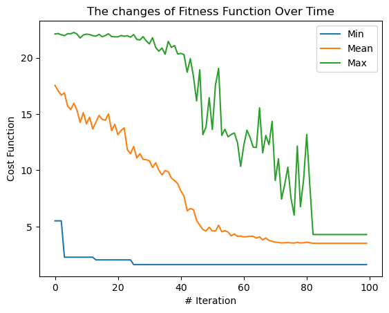

# pyticle
A Python Library for Particle Swarm Intelligence

[](https://app.circleci.com/pipelines/github/owhadi)

This package implements the Particle Swarm Optimization (PSO) algorithm in pure python. The only thing you need to is 
installing the package and call it with the right parameters!

PSO is an interactive meta-heuristic algorithm that uses "particles" as a candidates for solutions. The goal is to move the particles 
towards the global/local minimum in each iteration.

## Installation
Simply install this package by running the following command:
```bash
pip install pyticle 
```

## Usage

To minimize the 2D function `my_func` in range [-15, 10] using 100 particles via 80 iterations:

```python
from pyticle.benchmark import Benchmark
from pyticle.swarm_optimization import SwarmOptimization
optimizer = SwarmOptimization(cost_func=Benchmark.ackley, particle_num=100, omega_start=1, omega_end=0.0, coef=[2.0, 2.0], 
                              low_bound=-15.0, high_bound=10, boundary_strategy='random', var_size=2, max_iter_num=80, 
                              elite_rate=0.1)
optimizer.optimize()
```

## Meta-Search
Meta-search means searching for the right hyper-parameters of the optimizer. Here is a simple example of using the `MetaSearch` class:

```python
from tabulate import tabulate

from pyticle.benchmark import Benchmark
from pyticle.meta_search import MetaSearch

ms = MetaSearch(cost_func=Benchmark.ackley, var_size=2, low_bound=-32, high_bound=32)
result = ms.search(try_num=8, n_jobs=8)
print(tabulate(result, headers='keys', tablefmt='psql'))
```


## Demo

In this section, you can see the results of using this package for two simple 2D benchmarks. To run the benchmarks, run:

```python
from pyticle.demo_run import demo_run
demo_run()
```

### The Sphere Function
Here is the evolution of 100 particles in 100 iterations to find the minimum of [the Sphere function](https://en.wikipedia.org/wiki/File:Sphere_function_in_3D.pdf):


Here is the changes in the minimum, average, and maximum values of the cost function of all particles over time:



### The Ackley Function
Same as the previous example, this is the evolution of 100 particles in 100 iterations to find the minimum of [the Ackley function](https://en.wikipedia.org/wiki/Ackley_function):


Here is the changes in the minimum, average, and maximum values of the cost function of all particles over time:




## Contribution
You are very welcome to contribute to this project with your code (as pull-requests), mention the bugs or ask for new 
features (as GitHub Issues), or just tell your friends about it! 

You can also directly contact me by [email](moein.owhadi@gmail.com).
 
